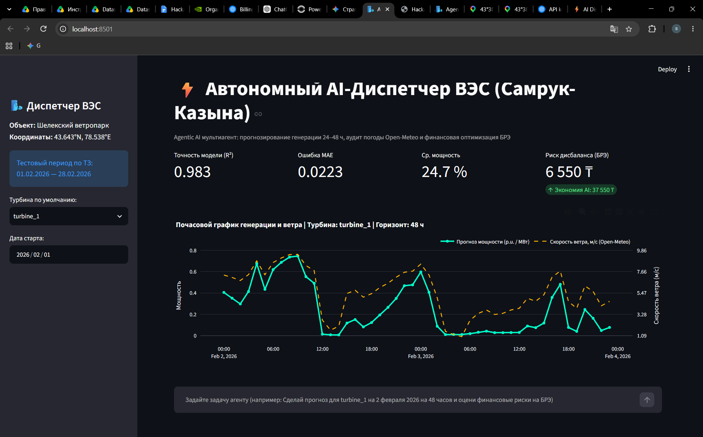
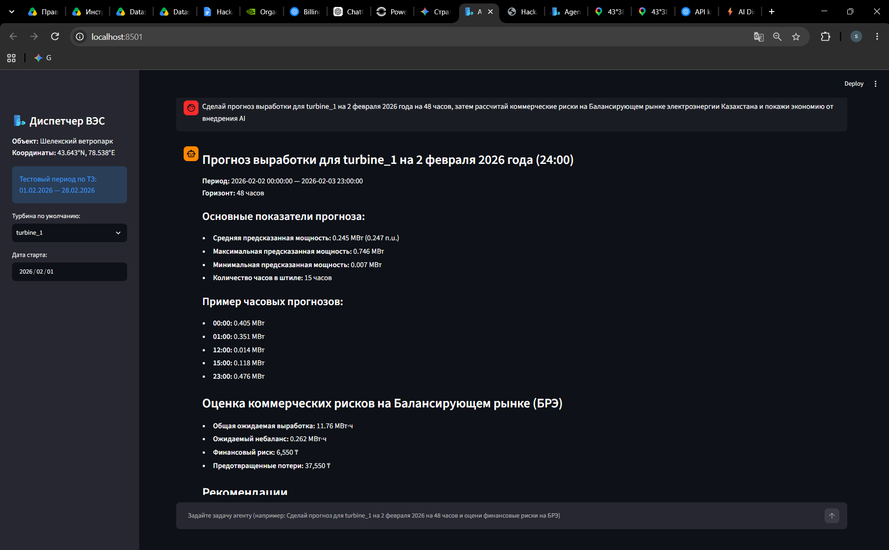

# ⚡ EnergyAI — Автономный Agentic AI-Диспетчер ВЭС

> Разработано в рамках хакатона **HackAlem AI**  
> **Трек:** Энергетика | **Кейс:** АО «Самрук-Қазына»  
> **Объект:** Шелекский ветровой коридор (п. Нурлы, Алматинская область)

---

## 1. Название проекта
**EnergyAI** — Мультиагентная система прогнозирования генерации ветроэлектростанций на базе Agentic AI, физического машинного обучения и внешних метеорологических сервисов.

---

## 2. Краткое описание
Проект решает проблему высокой стохастичности ветровой генерации и предотвращения небалансов в Единой электроэнергетической системе (ЕЭС) Казахстана. 
Решение разработано для:
* **Диспетчеров системного оператора (АО «KEGOC»)** — для предиктивного суточного планирования резервов мощности;
* **Коммерческих операторов ВЭС (АО «Самрук-Энерго»)** — для минимизации финансовых штрафов на Балансирующем рынке электроэнергии (БРЭ) при отклонении плана от факта.

---

## 3. Что реализовано
* **Agentic AI Orchestrator:** Интеллектуальный агент на базе OpenAI Function Calling, способный на естественном языке принимать команды диспетчера, координировать горизонт планирования и вызывать расчетные инструменты.
* **Динамическая интеграция с погодой:** Автоматический сбор почасовых архивных метеопрогнозов через Open-Meteo Historical Forecast API строго по координатам турбин (высота 10м и 100м, температура).
* **Физический Feature Engineering:** Реализация закона Беца ($P \sim v^3$) — расчет кубической зависимости мощности от скорости ветра.
* **Градиентный бустинг LightGBM:** Обучение на исторических 10-минутных данных SCADA (2023–2026 гг.) с часовой агрегацией и временным сплитом (защита от лика данных).
* **Модуль Балансирующего рынка (БРЭ):** Расчет финансовых рисков небалансов в тенге (₸) и предотвращенных финансовых потерь (ROI).
* **Пакетная суточная симуляция (февраль 2026):** Полное воспроизведение последовательного 24-часового прогнозирования за 28 дней для двух турбин (1344 точки).
* **Готовый файл сабмишна:** Сформирован официальный файл `submission_february_2026.csv`.
* **Интерактивный дашборд оператора:** Веб-интерфейс на Streamlit с темной темой, визуализацией кривой ветра/мощности (Plotly) и аудитом штилевых рисков.

---

## 4. Демонстрация работы системы

### Интерактивный дашборд и график генерации


### Экспертный AI-аудит и коммерческий расчет рисков БРЭ


---

## 5. Как работает решение
1. **Запрос диспетчера:** Оператор вводит задачу в свободной форме (например: *«Сделай прогноз для turbine_1 на 2 февраля 2026 на 48 часов и оцени риски БРЭ»*).
2. **Анализ и вызов инструментов:** LLM определяет параметры задачи и вызывает необходимые функции: `generate_agent_forecast` и `calculate_market_penalties`.
3. **Запрос внешних метеоданных:** Модуль обращается к Open-Meteo API и забирает прогноз ветра на высоте ротора (100 м) и температуру.
4. **ML-инференс:** Модель LightGBM генерирует почасовой ряд генерации с физическим клиппингом по рабочей мощности турбины.
5. **Аудит рисков и визуализация:** Диспетчер получает график выработки, метрики валидации ($R^2$, MAE), расчет финансового риска в тенге и структурированное диспетчерское заключение.

---

## 6. Технологии
* **Язык программирования:** Python 3.12
* **AI & Agentic Framework:** OpenAI API (`gpt-4o-mini` с поддержкой Function Calling)
* **Machine Learning & Data Science:** LightGBM, Scikit-learn, Pandas, NumPy
* **Внешние API:** Open-Meteo Historical Forecast API / Archive API
* **Визуализация и UI:** Streamlit, Plotly Dark
* **Конфигурация и окружение:** python-dotenv, Requests

---

## 7. Архитектура проекта

```text
┌─────────────────────────────────────────────────────────────┐
│                    Streamlit Web UI (app.py)                │
└──────────────────────────────┬──────────────────────────────┘
                               │ Естественный язык / Чат
                               ▼
┌─────────────────────────────────────────────────────────────┐
│             AI Agent Orchestrator (GPT-4o-mini)             │
│                 (OpenAI Function Calling)                   │
└──────────────┬──────────────────────────────┬───────────────┘
               │ Tool 1                       │ Tool 2
               ▼                              ▼
┌──────────────────────────────┐ ┌────────────────────────────┐
│   generate_agent_forecast    │ │ calculate_market_penalties │
│   (LightGBM + Open-Meteo)    │ │   (Финансовые риски БРЭ)   │
└──────────────┬───────────────┘ └────────────┬───────────────┘
               │                              │
               └───────────────┬──────────────┘
                               ▼
┌─────────────────────────────────────────────────────────────┐
│            Единый аналитический отчет и дашборд             │
│   (Метрики R², график Plotly, предотвращенные потери в ₸)   │
└─────────────────────────────────────────────────────────────┘